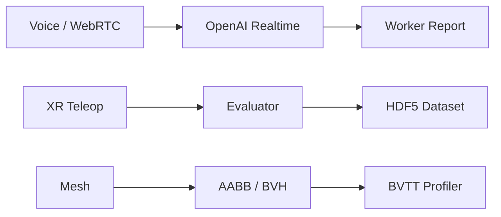

<pre>
 ______ ____   ___   ____ ____  ___ __  __
|  ____|  _ \ / _ \ / ___|  _ \|_ _|  \/  |
| |_  | |_) | | | | |  _| |_) || || |\/| |
|  _| |  _ <| |_| | |_| |  _ < | || |  | |
|_|   |_| \_\\___/ \____|_| \_\___|_|  |_|
</pre>

<p align="center">
  <a href="https://frogrim.github.io/">
    
  </a>
</p>

# 이강림 / FrogRim

실시간 AI, 로보틱스 데이터, 그래픽스/엔진 시스템을 성능 지표로 증명하는 개발자입니다.

```txt
> focus
realtime-ai | robotics-data | graphics-engine

> proof
latency, schema compliance, replayability, collision time
```

## System Map



## Featured Systems

| Repository | Signal | Evidence |
| --- | --- | --- |
| [LinguaCall](https://github.com/FrogRim/LinguaCall) | Realtime AI product | WebRTC direct voice path, PTT control, worker-based report pipeline |
| [LLM-First Robot Control](https://github.com/FrogRim/LLM-First-Robot-Control) | LLM -> robot control | 55.6% task success, 66.7% physical inference accuracy, JSON compliance 100% |
| [Robot Data Forge](https://github.com/FrogRim/ForgeXR) | Robotics data infrastructure | XR teleop -> evaluator -> curation -> HDF5 dataset artifact |
| [GPU 3D Algorithm](https://github.com/FrogRim/GPU_3DAlgorithm) | Graphics performance | Brute Force 847ms -> BVTT 126ms, collision accuracy 100% |
| [UE5 ITD Parser Plugin](https://github.com/FrogRim/UE5-ITD-Parser) | Engine tooling | UFactory importer skeleton, Static Mesh pipeline, Non-Manifold analysis |
| [Connect-AAC](https://github.com/FrogRim/Connect-AAC) | Accessibility AI | Flutter AAC UI, AI sentence recommendation, TTS flow |

## Stack Trace


## GitHub Telemetry


## Contact

- Portfolio: https://frogrim.github.io/
- Email: kangrim1025@gmail.com
