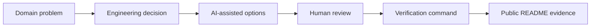

# FrogRim / 이강림

문제를 먼저 정의하고, AI를 지휘해 후보를 빠르게 만들고, 직접 검증한 결과만 시스템으로 남기는 개발자입니다.

<p align="center">
  <a href="https://frogrim.github.io/">
    
  </a>
</p>

```txt
focus  = realtime-ai | robotics-data | graphics-engine | agent-tooling
method = frame problem -> make decision -> direct AI -> verify -> document limits
proof  = latency, schema compliance, replayability, collision time, run commands
```

## What I Optimize For

| Principle | What it means in my projects |
| --- | --- |
| Domain problem first | 기능 목록보다 사용자가 겪는 지연, 데이터 품질, 제어 안정성, 입력 흐름 문제를 먼저 씁니다. |
| Engineering judgment | 대안, 선택 근거, tradeoff, scope cut, 실패 가능성을 README에 남깁니다. |
| AI as a directed tool | AI가 낸 코드를 그대로 수용하지 않고 성능/보안/확장성 관점으로 검토하고 수정합니다. |
| Evidence over claims | 실행 명령, 측정 조건, 수치, 한계까지 같이 기록합니다. |

## Featured Proof Matrix

| Repository | Problem I framed | Decision I made | Verification |
| --- | --- | --- | --- |
| [LinguaCall](https://github.com/FrogRim/LinguaCall) | 실시간 회화 UX와 학습 리포트가 분리되는 문제 | WebRTC direct voice path, API/worker split, launch stack 축소 | PTT flow, worker report split, launch smoke commands |
| [Robot Data Forge](https://github.com/FrogRim/ForgeXR) | raw teleoperation trajectory만으로 학습 가능성 판단 불가 | MVP-1은 policy uplift가 아니라 dataset artifact proof로 제한 | curation manifest, HDF5 export, trainer loader smoke |
| [GPU 3D Algorithm](https://github.com/FrogRim/GPU_3DAlgorithm) | brute force collision detection 비용 증가 | AABB/BVH/BVTT 직접 구현과 동일 scene benchmark 비교 | 12,182 triangles, 847ms -> 126ms, accuracy 100% |
| [LLM-First Robot Control](https://github.com/FrogRim/LLM-First-Robot-Control) | 자연어 의도를 로봇 제어 파라미터로 바꾸는 간극 | LLM 출력을 설명문이 아니라 JSON control contract로 제한 | task success 55.6%, JSON compliance 100% |
| [UE5 ITD Parser Plugin](https://github.com/FrogRim/UE5-ITD-Parser) | 외부 3D format과 engine mesh contract 불일치 | 완성 importer보다 UFactory extension point와 geometry risk 분석에 집중 | UFactory skeleton, Non-Manifold mitigation notes |
| [HaltTrace](https://github.com/FrogRim/halttrace) | agent 세션이 멈출 때 원인 추적 맥락이 흩어지는 문제 | enforcement가 아닌 observer-only local event router와 bounded backtrace sink로 제한 | Claude/Codex wrappers, trigger policy, privacy-bounded local storage |

## How I Use AI

| Use | My control point |
| --- | --- |
| Architecture candidate generation | AI에게 후보를 뽑게 한 뒤 latency, 운영비, 구현 복잡도 기준으로 직접 reject/accept합니다. |
| Code and review acceleration | 생성된 코드는 lint/typecheck/test/smoke command를 통과해야만 남깁니다. |
| Risk discovery | 보안, schema drift, async worker failure, benchmark 과장 가능성을 AI에게 명시적으로 찾게 합니다. |
| Documentation | AI가 정리한 문장을 그대로 쓰지 않고, 내가 설명 가능한 decision/tradeoff/evidence 형태로 다시 씁니다. |

## System Map



## Stack By Problem Class


## Contact

- Portfolio: https://frogrim.github.io/
- Email: kangrim1025@gmail.com
