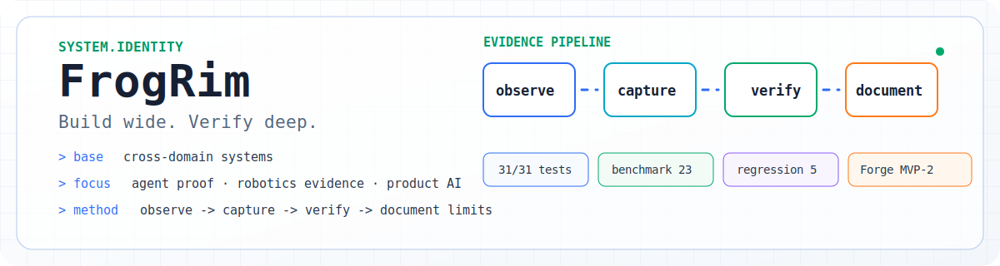

# FrogRim / 이강림

<p align="center">
  <picture>
    <source media="(prefers-color-scheme: dark)" srcset="assets/dark.svg">
    <source media="(prefers-color-scheme: light)" srcset="assets/light.svg">
    
  </picture>
</p>

AI를 많이 쓰는 사람이 아니라, AI가 낸 결과를 시스템으로 구현하고 실패 지점을 검증 가능한 증거로 닫는 개발자입니다.

<p align="center">
  <a href="https://frogrim.github.io/">
    
  </a>
</p>

```txt
role      = AI-native systems builder
base      = cross-domain generalist with system-level proof
method    = frame problem -> build system -> verify failure modes -> document limits
portfolio = https://frogrim.github.io/
```

## How To Read My Work

| Lens | Read first | What I prove |
| --- | --- | --- |
| AI / Agent Engineer | HaltTrace -> LinguaCall -> LLM-First Robot Control | agent/tool boundary 이해, contract test, AI 런타임 제품화 |
| Robotics / Defense / Systems | LLM-First Robot Control -> ForgeXR -> GPU 3D Algorithm -> UE5 ITD Parser | 제어 contract, 데이터 품질, 성능 측정, geometry/engine risk |
| Product AI Engineer | LinguaCall -> HaltTrace -> ForgeXR | 실시간 UX, 비동기 worker, 운영 가능한 launch stack |

## Featured Proof Matrix

| Repository | Problem I framed | Decision I made | Verification |
| --- | --- | --- | --- |
| [HaltTrace](https://github.com/FrogRim/halttrace) | agent 세션이 멈춘 뒤 원인 후보와 다음 체크가 손으로 흩어지는 문제 | observer-only 원칙은 유지하고 `latest/explain/handoff/doctor`로 로컬 dump 분석, 상태 점검, handoff prompt 생성을 자동화 | npm test 31/31, dump workflow + skill sync tests, no retry/network/provider dependency |
| [LinguaCall](https://github.com/FrogRim/LinguaCall) | 실시간 AI 회화 MVP가 데모를 넘어 실제 브라우저 음성 왕복과 운영 배포까지 닫혀야 하는 문제 | OpenAI Realtime GA 방식으로 전환하고 `/v1/realtime/client_secrets`와 `/v1/realtime/calls` SDP flow를 분리, VPS portfolio build에서는 AppInToss를 기본 제외 | browser microphone round-trip confirmed, Realtime GA client secret/SDP flow, VITE_BUILD_APPINTOSS=false default, VPS portfolio demo deployed |
| [LLM-First Robot Control](https://github.com/FrogRim/LLM-First-Robot-Control) | 자연어 의도를 로봇 제어 파라미터로 바꾸는 간극 | LLM 출력을 설명문이 아니라 JSON control contract로 제한 | task success 55.6%, JSON compliance 100% |
| [Robot Data Forge](https://github.com/FrogRim/ForgeXR) | raw robot-action trajectory만으로 학습 가능성과 구매 신뢰성을 판단하기 어려운 문제 | HMD-first 데모가 아니라 data trust layer로 재정의하고 MVP-1 dataset artifact, MVP-1+ cross-embodiment adapter, UR file-backed lineage를 분리 | data trust proof 4 accepted/4 rejected, MVP-1+ 4 adapters, HDF5/trainer smoke, UR SHA-256 lineage, MVP-2 harness_ready=true/proof_eligible=false |
| [GPU 3D Algorithm](https://github.com/FrogRim/GPU_3DAlgorithm) | brute force collision detection 비용 증가 | AABB/BVH/BVTT 직접 구현과 동일 scene benchmark 비교 | 12,182 triangles, 847ms -> 126ms, accuracy 100% |
| [UE5 ITD Parser Plugin](https://github.com/FrogRim/UE5-ITD-Parser) | 외부 3D format과 engine mesh contract 불일치 | 완성 importer보다 UFactory extension point와 geometry risk 분석에 집중 | UFactory skeleton, Non-Manifold mitigation notes |

## What I Optimize For

| Principle | What it means in my projects |
| --- | --- |
| AI is directed, not obeyed | AI에게 후보를 만들게 하되 latency, scope, security, testability 기준으로 직접 reject/accept합니다. |
| Systems depth stays visible | AI/agent 직무가 아니어도 제어 contract, geometry risk, benchmark 조건, data artifact를 먼저 설명할 수 있게 씁니다. |
| Evidence over claims | "검증했다"는 말 대신 실행 명령, 수치, 실패 조건, known limit을 남깁니다. |
| Same work, different lens | 한 프로젝트를 agent reliability, product AI, robotics/system engineering 관점에서 다르게 읽히게 정리합니다. |

## Stack By Problem Class


## AI Workflow Telemetry

<p align="center">
  
</p>

Local AI coding logs are summarized with `ccusage` and committed as SVG cards. I treat this as workflow telemetry, not a skill claim: the important part is still whether the output is framed, tested, reviewed, and documented.

## Contact

- Full portfolio: https://frogrim.github.io/
- Email: kangrim1025@gmail.com
